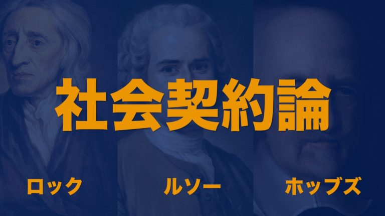
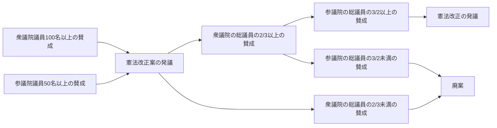
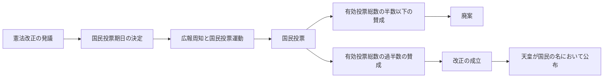

# 前期試験対策

## P.24~25

|語句|意味|
|:--:|:--:|
|宗教|祈ったり、儀式を実践したり、教典や施設を整備したと聖なるものや人間の力を超えた存在への信仰を表現すること|
|世界宗教|みずからを世界に広がる普遍性を持つ宗教→キリスト教、イスラム教、仏教|
|民族宗教|特定の民族や文化のなかで信仰される宗教→ユダヤ教、神道、ヒンドゥー教|
|世俗化|合理的な考え方が強まった近代においては、宗教的なものを社会の基準とすることをやめて、世俗的な公共空間を重視するようになったこと|
|ポスト世俗化|宗教観を大切にする人たちとの共生こそ重要であるとする考え|
|寛容|もともとは異なる宗教的な考え方を持つ他者を許すという態度のこと。今では他者を受け入れる心の動きをさす。|

## 世界宗教について
|宗教名|キリスト教|イスラーム（イスラム教）|仏教|
|:--:|:--:|:--:|:--:|
|創始者|イエス・キリスト|ムハンマド|ガウダマ＝シッダールタ（ブッダ）|
|時期|１世紀初め|７世紀初め|紀元前５世紀頃|
|場所|ローマ帝国の属領パレスチナ|アラビア半島メッカ|インド東北部マガダ国|
|信者数（2020年）|25.5億人|19.3億人|5.5億人|
|教典|新約聖書・旧約聖書|クルアーン（コーラン）|仏典（多種な教典）|
|概要|イエス・キリストは救世主。神の愛。隣人愛|唯一神（アッラー）。偶像崇拝禁止（要は実体を持たない）。六信五行|四諦（苦悩の原因を知り、それを取り去って悟りにいたる道筋。四つの真理）。八正道（悟りにいたるための具体的な修行方法）。縁起説（すべての事象は相互に依存しあって生成変化しているという考え）。慈悲の心。|

※六信五行・・・神、天使、啓典、預言者、来世、天命を信じる。信仰、礼拝、喜拾、断食、巡礼をする。

## P.44~45
|語句|意味|
|:--:|:--:|
|自然権|そもそも人間がもっている差別を受けない権利、思うままの意見をのべる権利、不当に身体を拘束されない権利、仕事を選ぶ権利などなど|
|社会契約|自然権をよりよく守るために、人々が互いに約束して**国家**（政府）をつくるという考え方での約束のこと|
|憲法|社会契約を文書にまとめたもの|
|モンテスキュー（1689~1755）|「法の精神」のなかで、権力分立の必要性をとき、特に**司法権**（立法、執行が正常かチェックする）、**立法権**（法を制定する権力）、**執行権**(法を執行する権力)という感じに分けることの重要性を訴えた人物。**三権分立**的な話もこの人。|
|近代立憲主義|政府の役割は個人の権利や自由を守ることだとして、政府に憲法を守るよう求め、憲法によって国家の権力を制限しようとする考え|
|硬性憲法|改正するための手続きが通常の法律より厳格な憲法でその下では、憲法は多数決によってかんたんに改正できないようになっている|
|国民主権|君主や貴族ではなく国民が国のつくり手であり、権力と正当性の源であるという原則|
|民主主義|国民主権に基づいた政治の在り方|
|代表民主制（間接民主制）|民主主義の政治のなかで一般的な「選挙で選ばれた代表が多数決によって議会で決める制度」|
|基本的人権の尊重|自由や平等などは、誰であっても侵されてはならないという理念|
|権力分立|権力を一か所に集中させるべきではないため２つ以上に分割すること|
|抑制と均衡|権力をただ分割するだけでなく大統領や内閣の権限行使を議会が制定する法律で縛り、その法律を裁判所が審査するなどすること。|
|人の支配|すべての権力が個人に委ねられてしまいオワコンって感じ。少数派や反対派の人権が侵害される危険が多い|
|法の支配|政治は、憲法など、国家権力も従うべきルール（法）によって行われるべきであるという考え方。ここでの法は自然権であると考えられる|
|近代憲法の成り立ち|国民主権、基本的人権の尊重・権力分立、法の支配の原則から成り立っている。|

## 思想家たちについて
|思想家|ホッブズ(1588~1679)|ロック(1632~1704)|ルソー(1712~1778)|
|:--:|:--:|:--:|:--:|
|主著|「リヴァイアサン」(1651)|「統治二論」(1690)|「社会契約論」(1762)|
|自然権についての考え方|人間は利己的動物、自己保存の自然権を持つ。「各人の各人に対する闘争」|人間はみな生命・自由・財産に関する自然権を持ち、自然法に従って共存している|人間は本来は平等。幸福で善良な状態。|
|社会契約の考え方|人間はお互いに契約を結んで国家をつくる。契約時に、自然権を守る力をすべて主催者の権力に委ね、その後は政府の方針に従う。（絶対王政）|自然権を守るために社会をつくり、政府に信託。政府が自然権を保護しない場合は倒すことができる。（**革命権**）|個人どうしが全員一致の契約によって社会をつくり、人々に共通する一般意思に基づいて国家の基本原則を定める。|
|特徴・影響|主張の背景にピューリタン革命。結果的に王政を中心とした体制を主張。内乱を終結させる強大な主権国家を構想した。|代表民主制を主張。名誉革命後の体制に影響を与えた。アメリカ独立革命、フランス革命に影響を与えた。|直接民主制の理論として受容された。フランス革命に影響を与えた。|

## P.50~51
|語句|意味|
|:--:|:--:|
|大日本帝国憲法|別名明治憲法で天皇主権をうたっていた。|
|ポツダム宣言|第二次世界大戦を終結させた宣言で日本はこれを受諾した。|
|GHQ|日本語で連合国軍総司令部といい、日本にポツダム宣言の趣旨から大日本帝国憲法の見直しを示唆した。|
|マッカーサー草案|極東委員会の反応を恐れたGHQが出した、戦争の放棄などの三原則を示しつつ、諸外国の憲法や民間の憲法草案を参考につくられた憲法の改善案|
|日本国憲法|1946年11月3日（文化の日）に公布され、1947年5月3日（憲法記念日）に施行された憲法。基本原理として国民主権、基本的人権の尊重、平和主義の３つがある。|
|国民主権|天皇の統治権が認められていた大日本帝国憲法とは違い、国のあり方を決定する主体が国民であるということ。「国政は国民の厳粛な信託による」と宣言され、正当な選挙で選ばれた国民の代表が国会で政治を行う代表民主制が採用されている。|
|直接民主制|日本の国政レベルではあまり見られないが最高裁判所裁判官の国民審査や憲法改正の国民投票などに限定されている。|
|天皇|政治的権能を持たない「日本国」と「日本国民統合」の象徴|
|基本的人権の尊重|「侵すことのできない永久の権利」を全国民に付与するということ。国による人権への制約は必要最小限度のものしか許されない|
|平和主義|軍国主義と植民地主義・侵略戦争、沖縄戦うあ原爆投下などの悲惨な経験から大日本帝国憲法では天皇が軍の統帥権を握っていたのに対して日本国憲法９条は戦争の放棄を定めている。この特徴的な条項により日本国憲法は**平和憲法**ともよばれる。|
|最高法規|憲法のことをさす。これに反する法令は無効である。そのため憲法の改正には厳格な手続きが必要である。|
|国民投票法|憲法改正に関わる具体的な手続きについて定められたもの|
|憲法改正|一部を改正するよということで全面的に改正するわけではない。また一般的に三大原理のような憲法の根本や憲法改正の手続き自体を変えることはできないとされている|
|日本国憲法において、天皇や貴族の身分が改められたのはなぜだろうか？|統帥権の独立を理由にしだいに拡大する軍部に対して、内閣などがブレーキをかけられず、最後は軍国主義と悲惨な戦争を招いたため|

## 憲法改正案の発議から憲法改正の発議まで

## 憲法改正の発議から改正の成立まで

※国民投票期日は憲法改正の発議後60日から180日以内

## 日本国憲法施行までの流れ
|年月日|事項|
|:--:|:--:|
|1945.8.14|日本政府、ポツダム宣言を受諾|
|1945.10.11|マッカーサー元帥、幣原喜重郎首相に自由主義化した憲法改正を示唆|
|1945.10.25|憲法問題調査委員会（委員長：松本蒸治）を設置|
|1946.1.1|天皇の人間宣言|
|1946.2.8|政府、「憲法改正要綱」（松本試案）をGHQに提出|
|1946.2.13|GHQ、松本試案を拒否。マッカーサー草案を日本側に手交|
|1946.2.22|政府、マッカーサー草案受け入れ決定|
|1946.3.6|政府、マッカーサー草案をもとに「憲法改正草案要綱」発表。マッカーサー、これを全面承認の声明|
|1946.6.20|第90回帝国議会に憲法改正案を提出|
|1946.10.7|両院の議員成立で日本国憲法成立|
|1946.10.29|枢密院、憲法改正案を可決|
|1946.11.3|日本国憲法公布|
|1947.5.3|日本国憲法施行|

## P.62~63
|語句|意味|
|:--:|:--:|
|ジェノサイド|大量虐殺のこと|
|人権の国際化|人権保障が世界の共通課題であるという認識が広まったために進んでいること|
|世界人権宣言|1948年に国際連合、通称国連で採択された人権の尊重は世界共通の基礎であるとすること。|
|国際人権規約|1966年に採択され、1976年に発効した条約で法的拘束力を有している。|
|人種差別撤廃条約|1965年に採択された|
|女子差別撤廃条約|1979年に採択|
|児童の権利に関する条約|1989年に採択|
|障害者の権利に関する条約|2006年に採択|
|男女雇用機会均等法|1975年に日本国内で採択された。日本が女子差別撤廃条約を批准するにともなって整備された。このように国内法化された条約は法律よりも上位の効力を有する。|
|アパルトヘイト|人種隔離政策とも呼ばれる|
|人権理事会|2006年に設立された人権と基本的自由の保護・促進を目的として人権委員会に代わってつくられた。|
|国際刑事裁判所|2003年に大量虐殺や戦争犯罪、侵略罪|
|NGO|自発的に人権問題に取り組み、「良心の囚人」の解放や、子供の権利の保護について頑張ってる。例）アムネスティ・インターナショナル|
|アムネスティ・インターナショナル|「暴力も用いてないのに、信念や信仰、人種、発言内容、あるいは性的指向を理由として囚われている人々」と定義されている|
|難民の地位に関する条約|難民条約と呼ばれる。1951年に採択された。難民の保護を目的としていて条約加入国は難民を強制的に追放・送還しない、難民に自国民と同等の待遇を与えるなどの義務がある。|
|難民|人種、宗教、国籍、政治的信条などを理由とした政治的被害を避けるために自国以外にいる人|
|国内避難民|故郷を離れたものの自国内で避難している人。条約の保護が及ばない。|
|国連難民高等弁務官事務所|アルファベットで**UNHCR**である。国内避難民を含めた難民に国際的な保護を与え、自由な本国への帰還や第三国への定住を援助している。**しかし貧困や環境破壊を理由に国外に脱出している人は難民に含まれていない**|
|これから大事とされていること|多様な文化や価値観と接するこれからの社会においては、人々が互いを尊重しあい、**協働**していくこと|

## P.136~137
|語句|意味|
|:--:|:--:|
|経済的な選択|消費者は限られた収入印紙の中でどのように商品を組み合わせて購入するのかを考えなければならないということ|
|市場メカニズム|経済的な選択に加えて生産者側がなにをどのくらいつくるのかを調整することも含めて消費者と生産者の選択を調整するもの|
|財・サービス|商品などを指す|
|貨幣|生産者と消費者との間で交換の仲立ちになるもの。お金|
|市場|貨幣と財・サービスを交換する場|
|価格|市場で調整の役割を担っている|
|市場経済|価格を媒介として消費者と生産者が動く仕組みのこと|
|経済|限りない人間の要求に対して資源が限られる、つまり**資源の希少性**があるなかで、それを効率よく分配して、社会全体を豊かにする活動|
|トレードオフ|経済学の考え方のひとつであちらを立てればこちらが立たずという「２つよい」ことはない状況を指す|
|機会費用|別の用途に使えば得られた利益を費用として認識した場合の費用。例えば大学進学には学費という費用がかかる。一方で就職していたら働くことによって収入を得ることがができる。大学進学の場合この収入を犠牲にしたという意味で、勤労の収入は進学の機械の費用に含めるべきである。|
|家計|個人や家族で構成される。消費者としての役割のみならず、労働者として労働サービスを供給する役割、貯蓄を通じて資本を供給する役割。|
|企業|生産者としての役割がある。家計から供給された資本と労働で商品を生産し、その商品を販売した収入から賃金などの分配を行う。|
|政府|家計・企業から税金を徴収し、公的サービスとして還元する。|
|経済の循環|財やサービスが経済主体の間で貨幣を仲立ちとして取り引きされる様子|
|分業|必要な商品のすべてを一人で生産できないため特定の生産物に特化すること。垂直分業と水平分業がある。|

## P.138~139
|語句|意味|
|:--:|:--:|
|需要|消費者がほしいという気持ち|
|供給|生産者が商品をつくる|
|市場価格|商品の需要量と供給量の大小により市場で決まる価格。これとは他に政府の決める価格である**公定価格**がある|
|価格の自動調整機能|消費者の需要量と生産者の供給量が、価格の動きを仲立ちにして自動的に調整されること|
|計画経済|生産計画を政府が立てる経済のこと。過去にはソ連の政府が洋服や外食の生産規模を決める経済を行っていた。|
|混合経済|市場経済を基本とする国でも、政府が税を課したり、取り引きのためのルールを定めたりして市場メカニズムを是正する経済。|
|大きな政府|一般に、政府の介入が大きい社会|
|小さな政府|一般に、政府の介入が小さい社会|
|市場の失敗のケース|少数の企業しかなく、**競争**が起きにくい|