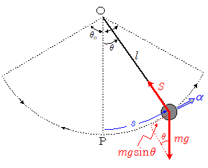

# 単振り子

軽い糸に小球をつるして鉛直面内で振動させたものを**単振り子**という。糸の長さがl [m]で小球の質量がm[kg]とする。
小球にはたらく力は糸が引く力Sと重力であり、糸が引く力の方向は小球の運動方向に対して垂直である。

半時計周りを正として糸が鉛直方向となす角をθ [rad]、原点Oからの円弧に沿った変位をｘ[m]とする。振れが小さいとき、単振り子は一直線上を往復しているとみなせるのでFは次のように表せる。上図のｓが直線移動距離ｘに近似しているので
$$
sin\theta = \frac l x
$$
となるので
$$
F = -mg sin\theta \simeq - \frac {mg} l x
$$

この式より、Fは大きさが変位ｘに比例し、つねに原点方向を向くことがわかる。
したがって、小球はFが復元力となって単振動をすると言える。

そこで単振動の式と比較して

$$
\begin{align}
m\omega^2 &= \frac {mg} l \\
\omega &= \sqrt{\frac g l}
\end{align}
$$
となる。また振動の周期Tは
$$
T = \frac {2\pi} \omega = 2\pi \sqrt{\frac l g}
$$

周期は糸の長さと重力加速度の大きさだけで決まり、振幅に無関係である。
このことを振り子の**等時性**という。