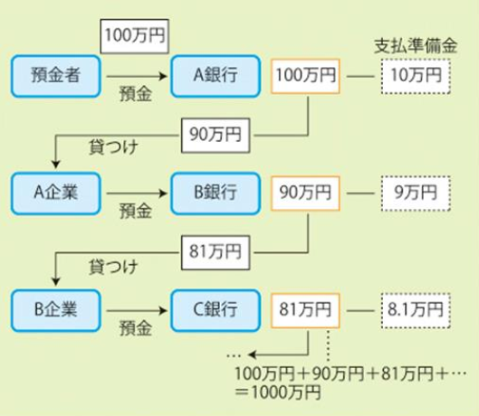
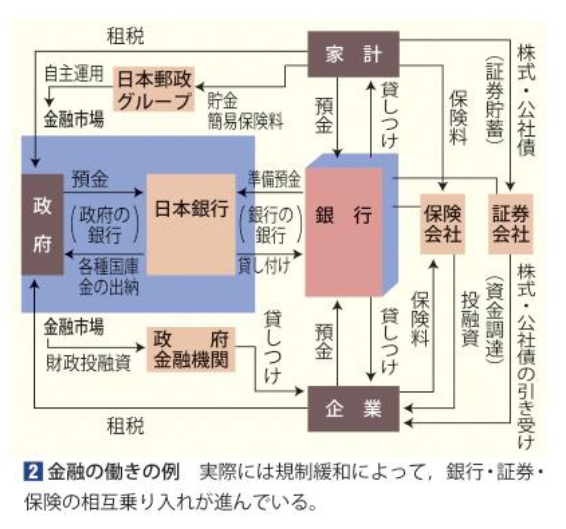
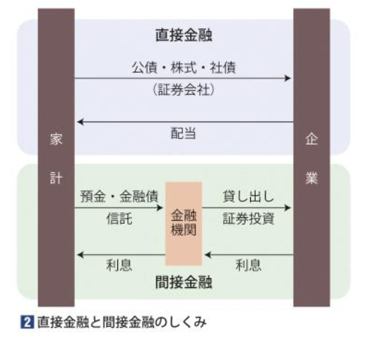
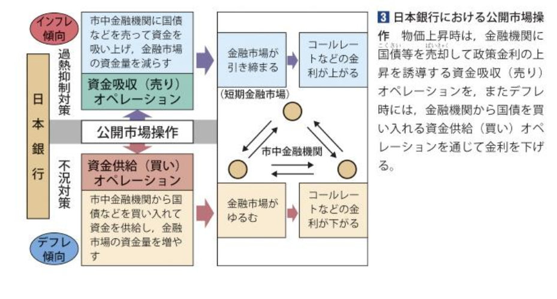

# P.146~147 金融の役割

## １．貨幣と通貨
通貨とは一国の経済のなかで流通している貨幣のことである。
例えば日本は現金通貨でありこれは**日本銀行券**である紙幣と政府が発行する硬貨（補助貨幣）のことを指す。

兌換券と呼ばれる**金と等価交換可能**な紙幣を用いる**金本位制度**も存在するが、1929年の**金融恐慌**のあとは**管理通貨制度**となっている。

## ２．金融の役割
**金融**・・・資金に余裕のある人から、資金を必要とする人へ、資金を**融通**すること。

このような金融が行われる際には金融機関が仲介を行っている。
またここでいう金融機関とは預金残高が莫大な都市銀行である**メガバンク**や特定地域に特化した銀行であるリージョナルバンクがある。

|メガバンク|リージョナルバンク|
|:--:|:--:|
|三菱UFJ銀行、みずほ銀行、三井住友銀行、ゆうちょ銀行|地方銀行、信用金庫、信用組合、農協（JA）・漁協|

金融機関の収益は預貯金や保険料であり、利子を設定して貸出することにより**金利**（貸出利息）というものに差を生み出すことで**信用創造**がなされる。

このように資金が流通していくことを金融と呼ぶが、金融にも種類がある。例えば、銀行などの金融機関が間に入り家計が蓄えておきたい資金を銀行に預金として預け、その預金を銀行が企業に貸し出すようなパターンを**間接金融**という。また、企業などの借り手が発行する社債や株式を、家計などの貸し手が直接購入するパターンを**直接金融**という。直接金融では手数料の費用などが比較的安いため、直接金融で資金を調達する企業が増えてきている。

ここで信用創造の仕組みについて考える。上の写真では支払準備率１０%の場合の信用創造について書かれている。はじめA銀行には100万円が預けられておりその１０％、すなわち１０万円を支払準備金として残し９０万円をA企業に貸し出している。そしてA企業が預金した９０万円のうち１０％すなわち９万円が支払準備金として残されて８１万円を貸し出している。このような流れを繰り返すことによって理論的に預金が創造される。
これは以下の式であらわされる

### 最初の預金額 / 支払準備率

よってこの図の場合では以下のようになる。
$$
1000000 / 0.1 = 10000000
$$
ここからはじめの預金額である１００万を引く。なので９００万円が新たにつくり出された貸付額となる。

## 金融とその働き

## ３．金融システムと中央銀行の金融政策
紙幣を見てみると、日本銀行券と印刷されている。日本銀行（通称：日銀）は日本の**中央銀行**であり、唯一の発券銀行として紙幣を発券できる権限をもっている。そして国が資金を出し入れする**政府の銀行**と金融機関に貸し出しする**銀行の銀行**としての役割ももっている。ちなむと硬貨を発行しているのは**独立行政法人造幣局**である。これの本局は大阪にあり、支局は東京・広島にある。

中央銀行は物価の安定、景気の安定、為替レートの安定を図るため、金融政策を行っている。たとえば貨幣が商品の価値以上に供給される**インフレーション**がおきたときに通貨や景気変動を調整する。

このような金融政策の主な手段には**公開市場操作**（**オープン・マーケット・オペレーション**）がありこれは、日本銀行が金融機関に対して国債などの有価証券を売り買いすることにより、家計や企業の保有する社会全体の通貨の総量である**マネーストック**（**通貨残高**）を調整する政策である。

通貨量が過剰な際には**売りオペレーション**により**金利上昇**を図り、不況の際には**買いオペレーション**により**金利下降**を図る。このような決定は**日銀政策委員会**の**金融政策決定会合**で行われる。

## ４．金融自由化と自己責任
かつての日本では**護送船団方式**とよばれる手厚い保護政策のもとで金利の規制や店舗数の制限などが採られてきたが経済のグローバル化が進むことでこれらの方式は行き詰まった。1990年代初頭にはバブル経済が起こり**モラルハザード**と呼ばれる**責任感の欠如**が顕在化し多額の不良債権をかかえ経営破綻の危機に陥った（山一證券・北海道拓殖銀行は破綻した）。そこでそれらの撤廃が行われることで**金融の自由化**が進んだ。1996年には**金融ビックバン**が掲げられたことにより銀行間の競争が激化した。その後、金融機関が破綻した際には利子のつく預金の払い戻しを一定限度まで保護する**ペイオフ**が実施された他、ICTの発展により金融（派生）商品を販売する（例：**サブプライムローン**・・・住宅ローン債券・米）やファイナンスとテクノロジーを融合した**フィンテック**を活用した動きが生まれた。またここでも**ディスクロージャー**（**情報開示**）の必要性が大きくなり預金者の**自己責任**が大きくなった。