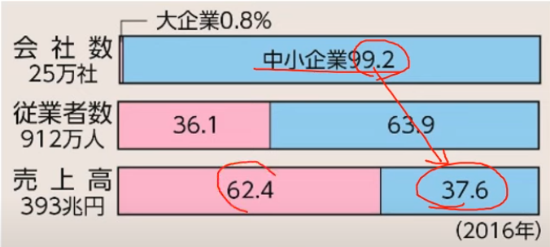
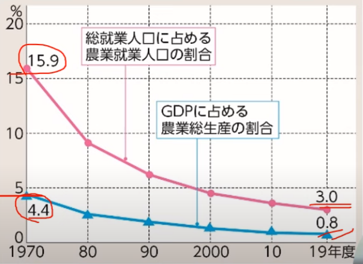

# P.170~171 中小企業と農業

## 中小企業の現状
日本経済というのは有名な**大企業**だけでなく数多くの**中小企業**によって支えられている。しかし、その中小企業と大企業の間には生産性や賃金において大きな格差がある。そして大企業と**下請け関係**を結んでいる中小企業は、大企業の影響下にある場合が多い。

ここで中小企業の定義について以下に示しておく。

|業種|資本金|従業員|
|:--:|:--:|:--:|
|製造業など|３億円以下|300人以下|
|卸売業|１億円以下|100人以下|
|サービス業|5000万円以下|100人以下|
|小売業|5000万円以下|50人以下|

上の表において資本金もしくは従業員のどちらかの条件を満たしていれば中小企業と言える。

次に大企業と中小企業の規模について比較したグラフを以下に示す。

このように中小企業は厳しい状況に置かれている。1990年代以降、数多くの中小企業が**倒産**した。要因として**熟練を要する分野での後継者不足**などが挙げられる。

しかし中小企業に可能性がないというわけではない。経営の見直しや新しい事業の開拓によって高度の**熟練技術**を生み出している。先端産業分野で海外に商品を輸出している企業、特定の商品で高いシェアを誇る企業のことである。

そして少人数のもと、新しい発送で事業を始める**ベンチャー企業**（スタートアップ）が増えてきている。これには政府の動きが関係しており従来、株式会社の設立には1000万の資本が必要とされていたが2006年より設立に必要な資本が**1円**になったのだ。

## 日本の農業とこれから
高度経済成長期（1950~1972）以来、多くの労働力が農村から**都市**へ移動。よって就業人口や耕地面積が減少傾向にある。また農家の大部分は、農業以外からの収入を多く受け取っている。このような農家は**兼業農家**と呼ばれる。

上の図からも農業をする人口の減少、GDPに占める農業総生産の割合の減少を観測することができる。

ここで日本は**農業基本法**というものを1961にとった。これは農業とほかの産業との格差是正を目指したものである。農業よりも農家の保護に重点を置き、米の過剰生産、いわゆる**米剰**を防ごうとした。

そして1970ごろより米の生産を調整する**減反**が始まったが、2018年には廃止された。

新食糧法が1994に制定され、1995に施行された。