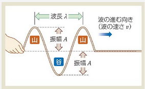

# 波の基礎
これからはある点で生じた振動が次々と周囲に伝わる現象である**波**（**波動**）について学ぶ

この写真は**正弦波**の波である。正弦波とは**各媒質が単振動して形がサインカーブの波**のことである。

図のとおり波形の最も高いところを**山**といい、最も低いところを**谷**という。また山の高さあるいは谷の深さを**振幅**という。

隣りあう山と山の間隔（谷でもよい）など、波１つ分の長さを**波長**といい普通表す記号に**λ**（らむだ）を使う。

ここで波の周期をT、振動数をfとするなら単振動と同じような以下の式が成立する。

$$
f = \frac 1 T
$$

また波の進む速度をvとするなら以下のように求めることが可能である。

$$
v = f λ \\
f = \frac 1 T より \\
vT = λ
$$