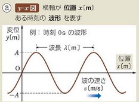
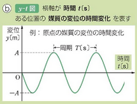

# 波と媒質の運動

## 波のグラフ
今回は波についてより数値的に理解する。

波の各位置（x）に対するその位置の媒質の変位を表すグラフ**y-x図**を以下に示す。

これは横軸に波を真横から見たときの媒質の位置、縦軸に各媒質に対応する変位をとる。このグラフには**時間についての説明がない**。わかりやすく言うなら運動している波の写真を取った際の様子を表すようなものだと言えるだろう。よって時間の経過によってこのグラフの形が全く変わるということに注意してほしい。

次にある１つの位置の媒質についての時間による変位の変化を表す**y-t図**を以下に示す。

これは横軸に時間、そして縦軸にその時間におけるある位置の媒質の変位を表す。このグラフには**位置の情報がない**。よって波形のうちある位置にある媒質がどのように運動しているかを読み取ることが可能なグラフである。例えば上の図によるとその媒質は時間の経過によって始めは負の方向に運動、その後正の方向へと運動している、そしてそれを繰り返しているということを読み取ることができる。最後に**これは波の波形ではないということに注意してほしい**。

## 波と媒質の運動
