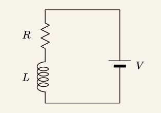

# RLCにおける周波数特性

## RL直列回路

まずはRL直列回路の周波数特性について考えてみる。上図では直流電源となっているが交流電源だと思ってくれ。

このような回路において回路全体のインピーダンスは以下のようになる。
$$
\dot{Z} = R + j\omega L = \sqrt{R^2 + (\omega L)^2} ∠ \tan^{-1}{\frac{\omega L}{R}}
$$
ひとつめの式は直交座標形式で２つ目の式はフェーザ表示である。