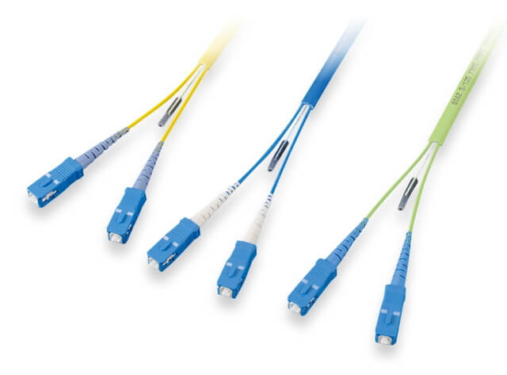

# No.1

## OSI参照モデル
|語句|意味|
|:--:|:--:|
|プロトコル|ルールや決まりごと。データをやり取りするための共通のルールおよび手順|
|HTTP|Hyper Text Transfer Protocolの略称。Webサイトでの情報をやり取りするためのプロトコル|
|プロトコルスタック|たくさんのプロトコルの集まりのこと。例）TCP/IP|
|ISO|International Organization for Standardizationの略称。国際標準化機構のこと。OSI参照モデルではベンダー間で異なる仕様の場合は相互通信できない。そのため標準モデルを定義し、役割に応じた層に分割|

## 絶対に出るOSI参照モデル
|層|名前|役割・機能|
|:--:|:--:|:--:|
|第７層　レイヤ７　L７|アプリケーション層|アプリケーション固有の通信サービスを実現。web、メール、...。HTTP、SMTP、POP3、DHCP、DNS、...など多数|
|第６層　レイヤ６　L６|プレゼンテーション層|文字コードや圧縮方式の定義|
|第５層　レイヤ５　L５|セッション層|アプリ同士の通信路（セッション）の制御|
|第４層　レイヤ４　L４|トランスポート層|信頼性の高い通信の保証。宛先に確実に届ける仕組み。TCP、UDPなどのプロトコル。|
|第３層　レイヤ３　L３|ネットワーク層|異なるネットワーク上ホスト間でのパケット伝送の仕組み。パケットの経路の計算（**ルーティング**）。論理アドレス（IPアドレス）により通信先を識別|
|第２層　レイヤ２　L２|データリンク層|同一ネットワーク内の通信の定義。物理アドレス（MACアドレス）でホストを識別|
|第１層　レイヤ１　L１|物理層|電気的・機械的な通信の定義。ビット「０」「１」のやり取り、ケーブル、コネクタなど|

## ケーブルの種類
|語句|意味|写真|
|:--:|:--:|:--:|
|ツイストペアケーブル|UTP(Unshielded Twist Pair Cable)やSTP(Shielded Twist Pair Cable)。RJ45コネクタがある||
|同軸ケーブル|||
|光ケーブル|||

## 物理層の機器
|語句|意味|
|:--:|:--:|
|NIC、リピータ|バス型トポロジ用減衰信号を増幅|
|ハブ|スタートポロジ用。すべてのポートに増幅信号を送出|

## データリンク層
|語句|意味|
|:--:|:--:|
|MACアドレス|ネットワーク機器を識別するための装置固有のID番号。NICに割り当て（ROMに書かれている）。48ビット|

$$
00\quad-\quad 30\quad-\quad 13\quad-\quad 6E\quad-\quad B6\quad-\quad 4A
$$

左半分が**ベンダー番号**で右半分が**シリアル番号**です。PCのMACアドレスはコマンドプロンプトで以下のコマンドを入力したときの「イーサネットアダプター」「ワイヤレスアダプター」などの欄にある12桁の16進数を見れば良い

```
ipconfig/all
```

## イーサネット
