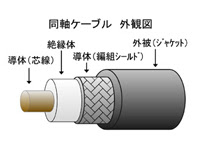

# No.1

## OSI参照モデル
|語句|意味|
|:--:|:--:|
|プロトコル|ルールや決まりごと。データをやり取りするための共通のルールおよび手順|
|HTTP|Hyper Text Transfer Protocolの略称。Webサイトでの情報をやり取りするためのプロトコル|
|プロトコルスタック|たくさんのプロトコルの集まりのこと。例）TCP/IP|
|ISO|International Organization for Standardizationの略称。国際標準化機構のこと。OSI参照モデルではベンダー間で異なる仕様の場合は相互通信できない。そのため標準モデルを定義し、役割に応じた層に分割|

## 絶対に出るOSI参照モデル
|層|名前|役割・機能|
|:--:|:--:|:--:|
|第７層　レイヤ７　L７|アプリケーション層|アプリケーション固有の通信サービスを実現。web、メール、...。HTTP、SMTP、POP3、DHCP、DNS、...など多数|
|第６層　レイヤ６　L６|プレゼンテーション層|文字コードや圧縮方式の定義|
|第５層　レイヤ５　L５|セッション層|アプリ同士の通信路（セッション）の制御|
|第４層　レイヤ４　L４|トランスポート層|信頼性の高い通信の保証。宛先に確実に届ける仕組み。TCP、UDPなどのプロトコル。|
|第３層　レイヤ３　L３|ネットワーク層|異なるネットワーク上ホスト間でのパケット伝送の仕組み。パケットの経路の計算（**ルーティング**）。論理アドレス（IPアドレス）により通信先を識別|
|第２層　レイヤ２　L２|データリンク層|同一ネットワーク内の通信の定義。物理アドレス（MACアドレス）でホストを識別|
|第１層　レイヤ１　L１|物理層|電気的・機械的な通信の定義。ビット「０」「１」のやり取り、ケーブル、コネクタなど|

## ケーブルの種類
|語句|意味|写真|
|:--:|:--:|:--:|
|ツイストペアケーブル|UTP(Unshielded Twist Pair Cable)やSTP(Shielded Twist Pair Cable)。RJ45コネクタがある||
|同軸ケーブル|||
|光ケーブル|||

## 物理層の機器
|語句|意味|
|:--:|:--:|
|NIC、リピータ|バス型トポロジ用減衰信号を増幅|
|ハブ|スタートポロジ用。すべてのポートに増幅信号を送出|

## データリンク層
|語句|意味|
|:--:|:--:|
|MACアドレス|ネットワーク機器を識別するための装置固有のID番号。NICに割り当て（ROMに書かれている）。48ビット|

$$
00\quad-\quad 30\quad-\quad 13\quad-\quad 6E\quad-\quad B6\quad-\quad 4A
$$

左半分が**ベンダー番号**で右半分が**シリアル番号**です。PCのMACアドレスはコマンドプロンプトで以下のコマンドを入力したときの「イーサネットアダプター」「ワイヤレスアダプター」などの欄にある12桁の16進数を見れば良い

```
ipconfig/all
```

## イーサネット
一般的な有線LANで規格は**IEEE802.3**（あいとりぷるいー）でアルファベットだと**Ethernet**

以下のように**帯域幅**、**通信方式**、**ケーブル種類**を記述する

$$
1000BASE-T
$$
この場合なら帯域幅は**1000 [Mbps]**で**ベースバンド通信方式**で**ツイストペアケーブル**であることを表す。

$$
10GBASE-SR
$$
この場合だと帯域幅は**10 [Gbps]**で**ベースバンド通信方式**で**光ケーブル**であることを表す。

##　フレーム
|語句|意味|
|:--:|:--:|
|フレーム|データリンク層のPDU(Protcol Data Unit)。データにパケットが入る|
|FCS|別名チェックサム。送信側と受信側が、フレームの内容をもとに同じ計算をする。通信が正しく行われているとき計算した値が同じ値になる。|

以下はパケットの例です。

|プリアンブル|宛先MACアドレス|送信元MACアドレス|タイプ|データ|FCS|
|:--:|:--:|:--:|:--:|:--:|:--:|
|８バイトでフレームの始まりの合図|６バイト|６バイト|２バイト|46~1500バイト|４バイト|

## CSMA/CD
|語句|意味|
|:--:|:--:|
|CSMA|Carrier Sense Multiple Access|
|CD|Collision Detection。イーサネットは早い者勝ち通信であるため同時アクセス時には衝突(Collision)が起こる|


ちなみに無線LANでは、衝突検知ができないため衝突回避(**Collision Avoidance**)してる

## ネットワーク機器
データリンク層に対応する機器

|語句|意味|
|:--:|:--:|
|ブリッジ|バス型。フレーム内の宛先MACアドレスをチェック、ポートに接続されているMACアドレスを転送するか判断|
|スイッチ|スター型。どのポートにどの機器のMACアドレスが接続されているか記憶。転送するか判断|

## コリジョンドメイン
衝突が起きる範囲のこと。ブリッジとスイッチはコリジョンドメインを分割。リピータ、ハブはドメイン分割できない。
コリジョンドメインが小さい＝邪魔される確率が低い　ということ。よって高速通信が可能

