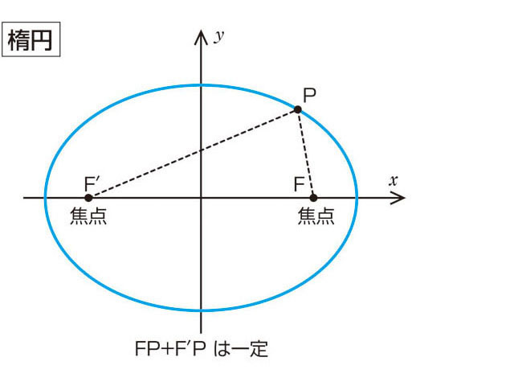

# 惑星の運動
従来人は太陽や惑星を含む天体は地球を中心に回転しているという**天動説**を信じていた。だけど**コペルニクス**が唱えた**地動説**がいい感じです。

## **ケプラーの法則**
ティコ・ブラーエくんの助手であるケプラーくんがティコ・ブラーエくんの観測資料を整理して得た結論だそうです。

|法則|内容|
|:--:|:--:|
|第一法則|惑星は太陽を１つの焦点とする楕円の上を運動する。|
|第二法則|惑星と太陽とを結ぶ線分が一定時間に通過する面積は一定である。これは**面積速度一定の法則**と言われる。|
|第三法則|惑星の公転周期Tの２乗と軌道楕円上の長半径（半長軸の長さ）aの３乗の比はすべての惑星で一定になる。|

#### 第２法則
$$
\frac 1 2 r_1 v_1 = \frac 1 2 r_2 v_2
$$

#### 第３法則
$$
\frac {T^2}{a^3} = k
$$

## ちなみに楕円って...

だ円は、ある決まった２点F、F`からの距離の和が等しい点Pの集まりである。
この２点を焦点と呼ぶ、だ円の２点を結ぶ線分のうち、２つの焦点F、F`を通るものを長軸、長軸を垂直に２等分する線を短軸という。長軸、短軸の半分の長さの線分をそれぞれ半長軸、半短軸という。